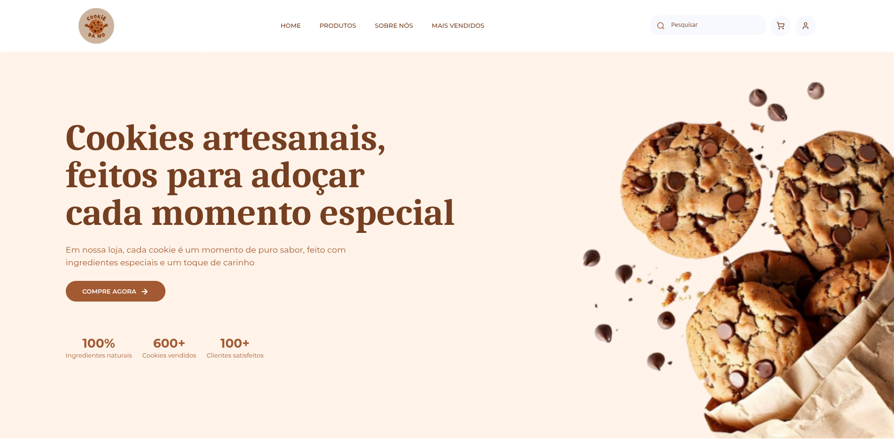
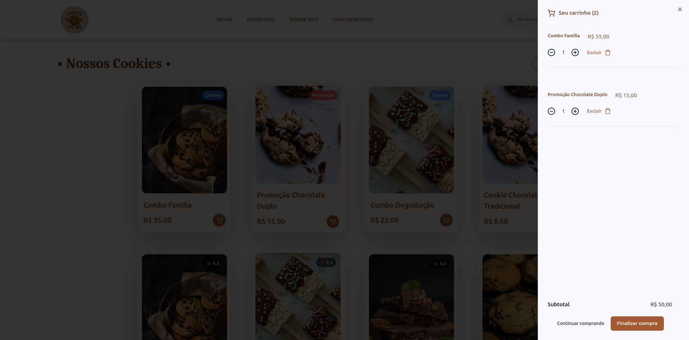
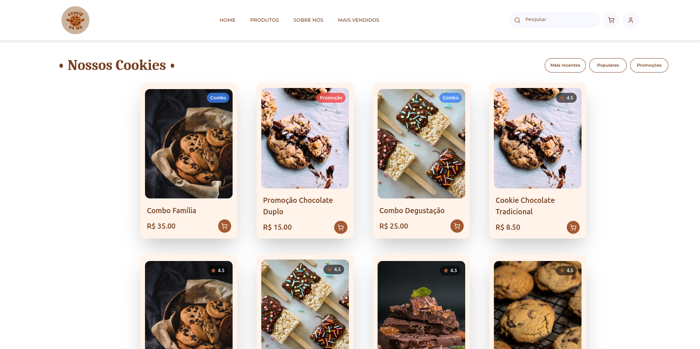

# 🍪 Site Cookies - E-commerce de Cookies


## 📋 Sobre o Projeto

Este é um projeto acadêmico desenvolvido como trabalho de aula, criado para atender às necessidades de uma **loja real de cookies**. O sistema consiste em um e-commerce completo com funcionalidades de vitrine de produtos, carrinho de compras, checkout e um painel administrativo para gerenciamento do negócio.

### 🎯 Objetivo

O projeto foi desenvolvido com fins educacionais, aplicando conceitos modernos de desenvolvimento web full-stack, enquanto resolve um problema real de uma loja de cookies que precisava de presença digital e sistema de vendas online.

## ✨ Funcionalidades

### 🛒 Área do Cliente

- **Catálogo de Produtos**: Visualização dos cookies disponíveis com fotos, descrições e preços
- **Carrinho de Compras**: Adicionar, remover e alterar quantidades de produtos
- **Checkout**: Finalização de pedidos com cálculo de frete e descontos
- **Promoções**: Sistema de promoções e cupons de desconto
- **Autenticação**: Login via Google OAuth

### 👨‍💼 Painel Administrativo

- **Gestão de Produtos**: Cadastro, edição e exclusão de produtos
- **Gestão de Pedidos**: Visualização e gerenciamento de pedidos
- **Gestão de Promoções**: Criação de promoções com datas de validade
- **Dashboard**: Visão geral do negócio

## 🛠️ Tecnologias Utilizadas

### Frontend

| Tecnologia         | Descrição                                |
| ------------------ | ---------------------------------------- |
| **SvelteKit 5**    | Framework web full-stack moderno         |
| **Svelte 5**       | Biblioteca de UI com reatividade nativa  |
| **TypeScript**     | Superset JavaScript com tipagem estática |
| **Tailwind CSS**   | Framework CSS utilitário                 |
| **Bits UI**        | Componentes de UI acessíveis para Svelte |
| **Lucide Svelte**  | Ícones modernos                          |
| **Embla Carousel** | Carrossel de imagens                     |
| **Svelte Motion**  | Animações fluidas                        |
| **Svelte Sonner**  | Notificações toast                       |

### Backend

| Tecnologia      | Descrição                                |
| --------------- | ---------------------------------------- |
| **SvelteKit**   | Server-side rendering e API routes       |
| **Drizzle ORM** | ORM TypeScript-first para banco de dados |
| **PostgreSQL**  | Banco de dados relacional                |
| **Arctic**      | OAuth 2.0 para autenticação              |
| **Oslo**        | Utilitários de criptografia e encoding   |
| **Argon2**      | Hash de senhas seguro                    |

### DevOps & Ferramentas

| Tecnologia      | Descrição                         |
| --------------- | --------------------------------- |
| **Docker**      | Containerização do banco de dados |
| **Vite**        | Build tool e dev server rápido    |
| **ESLint**      | Linting de código                 |
| **Prettier**    | Formatação de código              |
| **Drizzle Kit** | Migrations e studio do banco      |

## 🗄️ Modelo de Dados

O sistema possui as seguintes entidades principais:

- **Usuário**: Gestão de usuários e autenticação
- **Cliente**: Dados dos clientes da loja
- **Endereço**: Endereços de entrega dos clientes
- **Produto**: Catálogo de cookies
- **Promoção**: Promoções com período de validade
- **Pedido**: Pedidos realizados
- **Item do Pedido**: Produtos de cada pedido

## 🚀 Como Executar

### Pré-requisitos

- Node.js 18+ ou Bun
- Docker e Docker Compose

### Instalação

1. **Clone o repositório**

```bash
git clone <url-do-repositorio>
cd projeto_SiteCookies
```

2. **Instale as dependências**

```bash
npm install
# ou
bun install
```

3. **Configure as variáveis de ambiente**

```bash
cp .env.example .env
# Edite o arquivo .env com suas configurações
```

4. **Inicie o banco de dados**

```bash
npm run db:start
```

5. **Execute as migrations**

```bash
npm run db:push
```

6. **Inicie o servidor de desenvolvimento**

```bash
npm run dev
```

O projeto estará disponível em `http://localhost:5173`

### Scripts Disponíveis

| Comando             | Descrição                          |
| ------------------- | ---------------------------------- |
| `npm run dev`       | Inicia servidor de desenvolvimento |
| `npm run build`     | Gera build de produção             |
| `npm run preview`   | Preview do build de produção       |
| `npm run db:start`  | Inicia container PostgreSQL        |
| `npm run db:push`   | Sincroniza schema com banco        |
| `npm run db:studio` | Abre Drizzle Studio (GUI do banco) |
| `npm run lint`      | Executa linting                    |
| `npm run format`    | Formata código com Prettier        |

## 📸 Screenshots

<div align="center">
  
  
</div>

<div align="center">
  
  
</div>

## 👥 Equipe

Projeto desenvolvido como trabalho acadêmico.

## 📄 Licença

Este projeto foi desenvolvido para fins educacionais.

---

⭐ Se este projeto foi útil para você, considere dar uma estrela!
